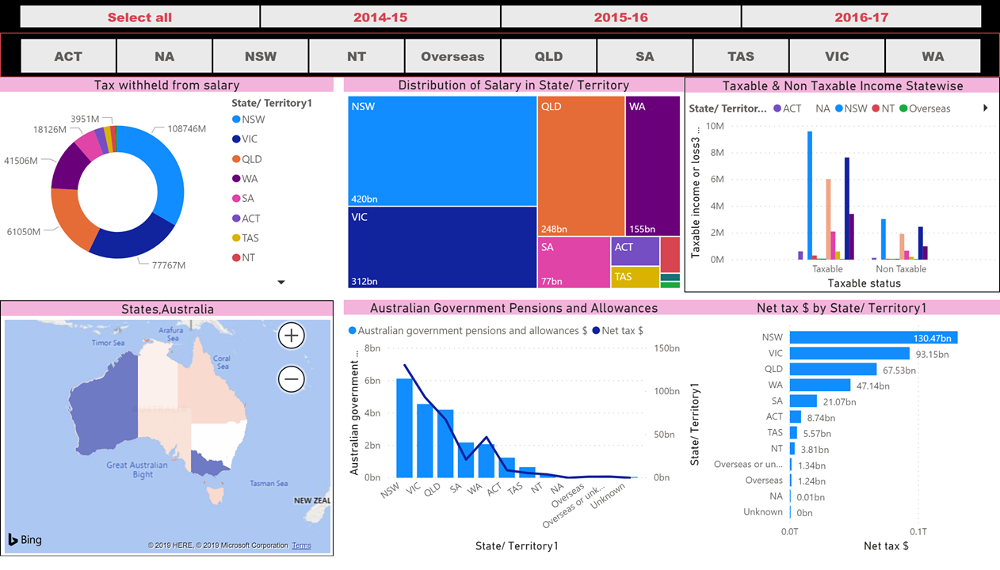

# AUSTRALIA TAXATION OFFICE's INDIVIDUAL TAX STATISTICS ANALYSIS

Image shown below was generated using a Power BI tool. Unfortuantely could not publish on the Web due to Licence issues.


```python
from IPython.display import Image
Image('C:/Users/nanda/Personal Project/ATO Tax/Image/ATO-Power BI.png')
```





```python
import pandas as pd
import numpy as np
import seaborn as sns
import matplotlib.pyplot as plt
```

We will Perfrom a exploratory Data Analysis with the available ATO dataset before we chose to build a model


```python
#Read the dataset
tax = pd.read_csv('C:/Users/nanda/Personal Project/ATO Tax/Data/ATO Data Merged - 2015-17.csv', parse_dates=True)
```

    C:\Users\nanda\Anaconda3\envs\dat2018\lib\site-packages\IPython\core\interactiveshell.py:3020: DtypeWarning: Columns (11,25,61,81,87,117,121,123,125,131,133) have mixed types. Specify dtype option on import or set low_memory=False.
      interactivity=interactivity, compiler=compiler, result=result)
    


```python
tax.head()
```


<div>
<style scoped>
    .dataframe tbody tr th:only-of-type {
        vertical-align: middle;
    }

    .dataframe tbody tr th {
        vertical-align: top;
    }

    .dataframe thead th {
        text-align: right;
    }
</style>
<table border="1" class="dataframe">
  <thead>
    <tr style="text-align: right;">
      <th></th>
      <th>Year</th>
      <th>Taxable status</th>
      <th>State/ Territory1</th>
      <th>Postcode</th>
      <th>Number of individuals 
no.</th>
      <th>Taxable income or loss3 
no.</th>
      <th>Taxable income or loss3 
$</th>
      <th>Tax on taxable income 
no.</th>
      <th>Tax on taxable income 
$</th>
      <th>Medicare levy 
no.</th>
      <th>...</th>
      <th>Low income tax offset 
$</th>
      <th>People with private health insurance 
no.</th>
      <th>Private health insurance - your Australian Government rebate received 
no.</th>
      <th>Private health insurance - your Australian Government rebate received 
$</th>
      <th>Private health insurance rebate 
no.</th>
      <th>Private health insurance rebate 
$</th>
      <th>Excess private health reduction or refund (rebate reduced) 
no.</th>
      <th>Excess private health reduction or refund (rebate reduced) 
$</th>
      <th>Unnamed: 152</th>
      <th>Unnamed: 153</th>
    </tr>
  </thead>
  <tbody>
    <tr>
      <th>0</th>
      <td>2015-16</td>
      <td>Non Taxable</td>
      <td>ACT</td>
      <td>2600</td>
      <td>925</td>
      <td>901</td>
      <td>10,094,504</td>
      <td>249</td>
      <td>478,204</td>
      <td>6</td>
      <td>...</td>
      <td>46,659</td>
      <td>662</td>
      <td>462</td>
      <td>413,270</td>
      <td>56</td>
      <td>24,623.00</td>
      <td>56</td>
      <td>24,897</td>
      <td>NaN</td>
      <td>NaN</td>
    </tr>
    <tr>
      <th>1</th>
      <td>2015-16</td>
      <td>Non Taxable</td>
      <td>ACT</td>
      <td>2601</td>
      <td>831</td>
      <td>810</td>
      <td>7,758,508</td>
      <td>115</td>
      <td>68,330</td>
      <td>2</td>
      <td>...</td>
      <td>22,856</td>
      <td>338</td>
      <td>129</td>
      <td>93,181</td>
      <td>26</td>
      <td>11,614</td>
      <td>20</td>
      <td>6,280</td>
      <td>NaN</td>
      <td>NaN</td>
    </tr>
    <tr>
      <th>2</th>
      <td>2015-16</td>
      <td>Non Taxable</td>
      <td>ACT</td>
      <td>2602</td>
      <td>3,805</td>
      <td>3,715</td>
      <td>46,099,115</td>
      <td>945</td>
      <td>1,076,605</td>
      <td>12</td>
      <td>...</td>
      <td>158,344</td>
      <td>2,003</td>
      <td>1,263</td>
      <td>873,545</td>
      <td>141</td>
      <td>52,488</td>
      <td>131</td>
      <td>32,617</td>
      <td>NaN</td>
      <td>NaN</td>
    </tr>
    <tr>
      <th>3</th>
      <td>2015-16</td>
      <td>Non Taxable</td>
      <td>ACT</td>
      <td>2603</td>
      <td>1,005</td>
      <td>966</td>
      <td>10,253,055</td>
      <td>230</td>
      <td>312,309</td>
      <td>6</td>
      <td>...</td>
      <td>43,085</td>
      <td>674</td>
      <td>419</td>
      <td>345,399</td>
      <td>52</td>
      <td>23,589</td>
      <td>52</td>
      <td>23,699</td>
      <td>NaN</td>
      <td>NaN</td>
    </tr>
    <tr>
      <th>4</th>
      <td>2015-16</td>
      <td>Non Taxable</td>
      <td>ACT</td>
      <td>2604</td>
      <td>1,125</td>
      <td>1,079</td>
      <td>12,622,243</td>
      <td>274</td>
      <td>437,725</td>
      <td>10</td>
      <td>...</td>
      <td>46,228</td>
      <td>672</td>
      <td>448</td>
      <td>323,645</td>
      <td>64</td>
      <td>20,564</td>
      <td>65</td>
      <td>24,806</td>
      <td>NaN</td>
      <td>NaN</td>
    </tr>
  </tbody>
</table>
<p>5 rows × 154 columns</p>
</div>


```python
tax1 = pd.read_csv('C:/Users/nanda/Personal Project/ATO Tax/Data/ATO Data Merged - 2015-17 - NSW.csv', parse_dates=True)
```

    C:\Users\nanda\Anaconda3\envs\dat2018\lib\site-packages\IPython\core\interactiveshell.py:3020: DtypeWarning: Columns (11,25,61,81,87,117,121,123,125,131,133) have mixed types. Specify dtype option on import or set low_memory=False.
      interactivity=interactivity, compiler=compiler, result=result)
    


```python
tax1
```


<div>
<style scoped>
    .dataframe tbody tr th:only-of-type {
        vertical-align: middle;
    }

    .dataframe tbody tr th {
        vertical-align: top;
    }

    .dataframe thead th {
        text-align: right;
    }
</style>
<table border="1" class="dataframe">
  <thead>
    <tr style="text-align: right;">
      <th></th>
      <th>Year</th>
      <th>Taxable status</th>
      <th>State/ Territory1</th>
      <th>Postcode</th>
      <th>Number of individuals 
no.</th>
      <th>Taxable income or loss3 
no.</th>
      <th>Taxable income or loss3 
$</th>
      <th>Tax on taxable income 
no.</th>
      <th>Tax on taxable income 
$</th>
      <th>Medicare levy 
no.</th>
      <th>...</th>
      <th>Low income tax offset 
$</th>
      <th>People with private health insurance 
no.</th>
      <th>Private health insurance - your Australian Government rebate received 
no.</th>
      <th>Private health insurance - your Australian Government rebate received 
$</th>
      <th>Private health insurance rebate 
no.</th>
      <th>Private health insurance rebate 
$</th>
      <th>Excess private health reduction or refund (rebate reduced) 
no.</th>
      <th>Excess private health reduction or refund (rebate reduced) 
$</th>
      <th>Unnamed: 152</th>
      <th>Unnamed: 153</th>
    </tr>
  </thead>
  <tbody>
    <tr>
      <th>0</th>
      <td>2015-16</td>
      <td>Non Taxable</td>
      <td>ACT</td>
      <td>2600</td>
      <td>925</td>
      <td>901</td>
      <td>10,094,504</td>
      <td>249</td>
      <td>478,204</td>
      <td>6</td>
      <td>...</td>
      <td>46,659</td>
      <td>662</td>
      <td>462</td>
      <td>413,270</td>
      <td>56</td>
      <td>24,623.00</td>
      <td>56</td>
      <td>24,897</td>
      <td>NaN</td>
      <td>NaN</td>
    </tr>
    <tr>
      <th>1</th>
      <td>2015-16</td>
      <td>Non Taxable</td>
      <td>ACT</td>
      <td>2601</td>
      <td>831</td>
      <td>810</td>
      <td>7,758,508</td>
      <td>115</td>
      <td>68,330</td>
      <td>2</td>
      <td>...</td>
      <td>22,856</td>
      <td>338</td>
      <td>129</td>
      <td>93,181</td>
      <td>26</td>
      <td>11,614</td>
      <td>20</td>
      <td>6,280</td>
      <td>NaN</td>
      <td>NaN</td>
    </tr>
    <tr>
      <th>2</th>
      <td>2015-16</td>
      <td>Non Taxable</td>
      <td>ACT</td>
      <td>2602</td>
      <td>3,805</td>
      <td>3,715</td>
      <td>46,099,115</td>
      <td>945</td>
      <td>1,076,605</td>
      <td>12</td>
      <td>...</td>
      <td>158,344</td>
      <td>2,003</td>
      <td>1,263</td>
      <td>873,545</td>
      <td>141</td>
      <td>52,488</td>
      <td>131</td>
      <td>32,617</td>
      <td>NaN</td>
      <td>NaN</td>
    </tr>
    <tr>
      <th>3</th>
      <td>2015-16</td>
      <td>Non Taxable</td>
      <td>ACT</td>
      <td>2603</td>
      <td>1,005</td>
      <td>966</td>
      <td>10,253,055</td>
      <td>230</td>
      <td>312,309</td>
      <td>6</td>
      <td>...</td>
      <td>43,085</td>
      <td>674</td>
      <td>419</td>
      <td>345,399</td>
      <td>52</td>
      <td>23,589</td>
      <td>52</td>
      <td>23,699</td>
      <td>NaN</td>
      <td>NaN</td>
    </tr>
    <tr>
      <th>4</th>
      <td>2015-16</td>
      <td>Non Taxable</td>
      <td>ACT</td>
      <td>2604</td>
      <td>1,125</td>
      <td>1,079</td>
      <td>12,622,243</td>
      <td>274</td>
      <td>437,725</td>
      <td>10</td>
      <td>...</td>
      <td>46,228</td>
      <td>672</td>
      <td>448</td>
      <td>323,645</td>
      <td>64</td>
      <td>20,564</td>
      <td>65</td>
      <td>24,806</td>
      <td>NaN</td>
      <td>NaN</td>
    </tr>
    <tr>
      <th>5</th>
      <td>2015-16</td>
      <td>Non Taxable</td>
      <td>ACT</td>
      <td>2605</td>
      <td>1,379</td>
      <td>1,333</td>
      <td>16,649,319</td>
      <td>363</td>
      <td>500,694</td>
      <td>7</td>
      <td>...</td>
      <td>58,983</td>
      <td>892</td>
      <td>570</td>
      <td>459,126</td>
      <td>48</td>
      <td>19,622</td>
      <td>46</td>
      <td>15,967</td>
      <td>NaN</td>
      <td>NaN</td>
    </tr>
    <tr>
      <th>6</th>
      <td>2015-16</td>
      <td>Non Taxable</td>
      <td>ACT</td>
      <td>2606</td>
      <td>1,089</td>
      <td>1,065</td>
      <td>13,469,370</td>
      <td>274</td>
      <td>526,828</td>
      <td>5</td>
      <td>...</td>
      <td>46,667</td>
      <td>566</td>
      <td>384</td>
      <td>306,486</td>
      <td>35</td>
      <td>14,690</td>
      <td>32</td>
      <td>8,783</td>
      <td>NaN</td>
      <td>NaN</td>
    </tr>
    <tr>
      <th>7</th>
      <td>2015-16</td>
      <td>Non Taxable</td>
      <td>ACT</td>
      <td>2607</td>
      <td>1,874</td>
      <td>1,831</td>
      <td>22,901,336</td>
      <td>499</td>
      <td>776,190</td>
      <td>8</td>
      <td>...</td>
      <td>90,506</td>
      <td>1,162</td>
      <td>752</td>
      <td>645,459</td>
      <td>72</td>
      <td>37,746</td>
      <td>47</td>
      <td>14,414</td>
      <td>NaN</td>
      <td>NaN</td>
    </tr>
    <tr>
      <th>8</th>
      <td>2015-16</td>
      <td>Non Taxable</td>
      <td>ACT</td>
      <td>2609</td>
      <td>107</td>
      <td>103</td>
      <td>1,418,632</td>
      <td>35</td>
      <td>41,582</td>
      <td>0</td>
      <td>...</td>
      <td>4,738</td>
      <td>46</td>
      <td>36</td>
      <td>22,635</td>
      <td>5</td>
      <td>877</td>
      <td>1</td>
      <td>1</td>
      <td>NaN</td>
      <td>NaN</td>
    </tr>
    <tr>
      <th>9</th>
      <td>2015-16</td>
      <td>Non Taxable</td>
      <td>ACT</td>
      <td>2611</td>
      <td>3,182</td>
      <td>3,105</td>
      <td>40,077,393</td>
      <td>905</td>
      <td>1,152,892</td>
      <td>6</td>
      <td>...</td>
      <td>156,383</td>
      <td>1,957</td>
      <td>1,375</td>
      <td>1,055,810</td>
      <td>135</td>
      <td>71,166</td>
      <td>104</td>
      <td>26,590</td>
      <td>NaN</td>
      <td>NaN</td>
    </tr>
    <tr>
      <th>10</th>
      <td>2015-16</td>
      <td>Non Taxable</td>
      <td>ACT</td>
      <td>2612</td>
      <td>1,827</td>
      <td>1,780</td>
      <td>20,044,161</td>
      <td>381</td>
      <td>386,290</td>
      <td>5</td>
      <td>...</td>
      <td>62,326</td>
      <td>866</td>
      <td>442</td>
      <td>325,129</td>
      <td>56</td>
      <td>24,228</td>
      <td>44</td>
      <td>13,788</td>
      <td>NaN</td>
      <td>NaN</td>
    </tr>
    <tr>
      <th>11</th>
      <td>2015-16</td>
      <td>Non Taxable</td>
      <td>ACT</td>
      <td>2614</td>
      <td>2,511</td>
      <td>2,451</td>
      <td>32,085,425</td>
      <td>709</td>
      <td>994,081</td>
      <td>12</td>
      <td>...</td>
      <td>125,422</td>
      <td>1,429</td>
      <td>973</td>
      <td>757,490</td>
      <td>84</td>
      <td>33,967</td>
      <td>67</td>
      <td>14,180</td>
      <td>NaN</td>
      <td>NaN</td>
    </tr>
    <tr>
      <th>12</th>
      <td>2015-16</td>
      <td>Non Taxable</td>
      <td>ACT</td>
      <td>2615</td>
      <td>5,059</td>
      <td>4,912</td>
      <td>63,602,898</td>
      <td>1,370</td>
      <td>1,547,746</td>
      <td>13</td>
      <td>...</td>
      <td>229,744</td>
      <td>2,602</td>
      <td>1,762</td>
      <td>1,256,604</td>
      <td>186</td>
      <td>79,044</td>
      <td>80</td>
      <td>17,314</td>
      <td>NaN</td>
      <td>NaN</td>
    </tr>
    <tr>
      <th>13</th>
      <td>2015-16</td>
      <td>Non Taxable</td>
      <td>ACT</td>
      <td>2617</td>
      <td>4,242</td>
      <td>4,118</td>
      <td>50,149,453</td>
      <td>1,033</td>
      <td>984,864</td>
      <td>12</td>
      <td>...</td>
      <td>198,186</td>
      <td>2,011</td>
      <td>1,303</td>
      <td>921,616</td>
      <td>131</td>
      <td>54,061</td>
      <td>82</td>
      <td>19,002</td>
      <td>NaN</td>
      <td>NaN</td>
    </tr>
    <tr>
      <th>14</th>
      <td>2015-16</td>
      <td>Non Taxable</td>
      <td>ACT</td>
      <td>2900</td>
      <td>230</td>
      <td>221</td>
      <td>2,640,932</td>
      <td>55</td>
      <td>56,678</td>
      <td>1</td>
      <td>...</td>
      <td>7,393</td>
      <td>119</td>
      <td>89</td>
      <td>66,322</td>
      <td>7</td>
      <td>2,592</td>
      <td>6</td>
      <td>2,295</td>
      <td>NaN</td>
      <td>NaN</td>
    </tr>
    <tr>
      <th>15</th>
      <td>2015-16</td>
      <td>Non Taxable</td>
      <td>ACT</td>
      <td>2902</td>
      <td>1,750</td>
      <td>1,712</td>
      <td>22,239,156</td>
      <td>487</td>
      <td>631,453</td>
      <td>4</td>
      <td>...</td>
      <td>89,343</td>
      <td>976</td>
      <td>655</td>
      <td>478,078</td>
      <td>65</td>
      <td>30,361</td>
      <td>38</td>
      <td>6,269</td>
      <td>NaN</td>
      <td>NaN</td>
    </tr>
    <tr>
      <th>16</th>
      <td>2015-16</td>
      <td>Non Taxable</td>
      <td>ACT</td>
      <td>2903</td>
      <td>1,105</td>
      <td>1,085</td>
      <td>13,502,347</td>
      <td>300</td>
      <td>362,403</td>
      <td>3</td>
      <td>...</td>
      <td>53,084</td>
      <td>610</td>
      <td>405</td>
      <td>284,069</td>
      <td>47</td>
      <td>24,764</td>
      <td>32</td>
      <td>8,268</td>
      <td>NaN</td>
      <td>NaN</td>
    </tr>
    <tr>
      <th>17</th>
      <td>2015-16</td>
      <td>Non Taxable</td>
      <td>ACT</td>
      <td>2904</td>
      <td>1,460</td>
      <td>1,429</td>
      <td>18,011,552</td>
      <td>400</td>
      <td>476,664</td>
      <td>1</td>
      <td>...</td>
      <td>68,206</td>
      <td>932</td>
      <td>596</td>
      <td>453,345</td>
      <td>56</td>
      <td>26,975</td>
      <td>43</td>
      <td>10,588</td>
      <td>NaN</td>
      <td>NaN</td>
    </tr>
    <tr>
      <th>18</th>
      <td>2015-16</td>
      <td>Non Taxable</td>
      <td>ACT</td>
      <td>2905</td>
      <td>2,996</td>
      <td>2,928</td>
      <td>37,780,696</td>
      <td>789</td>
      <td>781,005</td>
      <td>3</td>
      <td>...</td>
      <td>130,721</td>
      <td>1,587</td>
      <td>975</td>
      <td>617,224</td>
      <td>120</td>
      <td>47,069</td>
      <td>50</td>
      <td>7,897</td>
      <td>NaN</td>
      <td>NaN</td>
    </tr>
    <tr>
      <th>19</th>
      <td>2015-16</td>
      <td>Non Taxable</td>
      <td>ACT</td>
      <td>2906</td>
      <td>1,828</td>
      <td>1,784</td>
      <td>22,551,258</td>
      <td>454</td>
      <td>453,155</td>
      <td>2</td>
      <td>...</td>
      <td>86,477</td>
      <td>981</td>
      <td>529</td>
      <td>349,188</td>
      <td>63</td>
      <td>19,816</td>
      <td>29</td>
      <td>6,389</td>
      <td>NaN</td>
      <td>NaN</td>
    </tr>
    <tr>
      <th>20</th>
      <td>2015-16</td>
      <td>Non Taxable</td>
      <td>ACT</td>
      <td>2911</td>
      <td>384</td>
      <td>364</td>
      <td>3,420,748</td>
      <td>77</td>
      <td>48,525</td>
      <td>1</td>
      <td>...</td>
      <td>17,068</td>
      <td>191</td>
      <td>133</td>
      <td>84,278</td>
      <td>13</td>
      <td>3,319</td>
      <td>19</td>
      <td>5,196</td>
      <td>NaN</td>
      <td>NaN</td>
    </tr>
    <tr>
      <th>21</th>
      <td>2015-16</td>
      <td>Non Taxable</td>
      <td>ACT</td>
      <td>2912</td>
      <td>762</td>
      <td>734</td>
      <td>8,146,338</td>
      <td>154</td>
      <td>96,184</td>
      <td>2</td>
      <td>...</td>
      <td>30,730</td>
      <td>309</td>
      <td>216</td>
      <td>133,654</td>
      <td>32</td>
      <td>10,258</td>
      <td>15</td>
      <td>3,630</td>
      <td>NaN</td>
      <td>NaN</td>
    </tr>
    <tr>
      <th>22</th>
      <td>2015-16</td>
      <td>Non Taxable</td>
      <td>ACT</td>
      <td>2913</td>
      <td>3,785</td>
      <td>3,636</td>
      <td>42,075,913</td>
      <td>836</td>
      <td>898,179</td>
      <td>6</td>
      <td>...</td>
      <td>159,695</td>
      <td>1,896</td>
      <td>1,187</td>
      <td>751,953</td>
      <td>138</td>
      <td>44,517</td>
      <td>97</td>
      <td>23,525</td>
      <td>NaN</td>
      <td>NaN</td>
    </tr>
    <tr>
      <th>23</th>
      <td>2015-16</td>
      <td>Non Taxable</td>
      <td>ACT</td>
      <td>2914</td>
      <td>2,396</td>
      <td>2,306</td>
      <td>25,461,054</td>
      <td>488</td>
      <td>413,238</td>
      <td>6</td>
      <td>...</td>
      <td>89,719</td>
      <td>1,155</td>
      <td>721</td>
      <td>422,257</td>
      <td>80</td>
      <td>18,565</td>
      <td>62</td>
      <td>14,178</td>
      <td>NaN</td>
      <td>NaN</td>
    </tr>
    <tr>
      <th>24</th>
      <td>2015-16</td>
      <td>Non Taxable</td>
      <td>ACT</td>
      <td>ACT other</td>
      <td>111</td>
      <td>109</td>
      <td>1,511,196</td>
      <td>36</td>
      <td>28,802</td>
      <td>0</td>
      <td>...</td>
      <td>4,245</td>
      <td>42</td>
      <td>30</td>
      <td>20,497</td>
      <td>3</td>
      <td>272</td>
      <td>3</td>
      <td>185</td>
      <td>NaN</td>
      <td>NaN</td>
    </tr>
    <tr>
      <th>25</th>
      <td>2015-16</td>
      <td>Non Taxable</td>
      <td>NSW</td>
      <td>2000</td>
      <td>9,903</td>
      <td>9,620</td>
      <td>97,387,532</td>
      <td>1,504</td>
      <td>850,972</td>
      <td>14</td>
      <td>...</td>
      <td>357,465</td>
      <td>1,312</td>
      <td>939</td>
      <td>684,743</td>
      <td>158</td>
      <td>38,565</td>
      <td>80</td>
      <td>32,986</td>
      <td>NaN</td>
      <td>NaN</td>
    </tr>
    <tr>
      <th>26</th>
      <td>2015-16</td>
      <td>Non Taxable</td>
      <td>NSW</td>
      <td>2006</td>
      <td>22</td>
      <td>21</td>
      <td>263,484</td>
      <td>6</td>
      <td>1,094</td>
      <td>0</td>
      <td>...</td>
      <td>274</td>
      <td>11</td>
      <td>6</td>
      <td>3,902</td>
      <td>0</td>
      <td>0</td>
      <td>2</td>
      <td>2</td>
      <td>NaN</td>
      <td>NaN</td>
    </tr>
    <tr>
      <th>27</th>
      <td>2015-16</td>
      <td>Non Taxable</td>
      <td>NSW</td>
      <td>2007</td>
      <td>1,780</td>
      <td>1,741</td>
      <td>17,576,616</td>
      <td>257</td>
      <td>124,194</td>
      <td>4</td>
      <td>...</td>
      <td>59,289</td>
      <td>290</td>
      <td>186</td>
      <td>111,841</td>
      <td>34</td>
      <td>5,979</td>
      <td>15</td>
      <td>2,226</td>
      <td>NaN</td>
      <td>NaN</td>
    </tr>
    <tr>
      <th>28</th>
      <td>2015-16</td>
      <td>Non Taxable</td>
      <td>NSW</td>
      <td>2008</td>
      <td>1,781</td>
      <td>1,734</td>
      <td>17,908,751</td>
      <td>282</td>
      <td>138,823</td>
      <td>1</td>
      <td>...</td>
      <td>59,974</td>
      <td>379</td>
      <td>217</td>
      <td>128,041</td>
      <td>64</td>
      <td>13,710</td>
      <td>14</td>
      <td>3,794</td>
      <td>NaN</td>
      <td>NaN</td>
    </tr>
    <tr>
      <th>29</th>
      <td>2015-16</td>
      <td>Non Taxable</td>
      <td>NSW</td>
      <td>2009</td>
      <td>2,390</td>
      <td>2,311</td>
      <td>25,136,236</td>
      <td>412</td>
      <td>435,214</td>
      <td>10</td>
      <td>...</td>
      <td>79,563</td>
      <td>739</td>
      <td>581</td>
      <td>430,983</td>
      <td>89</td>
      <td>25,536</td>
      <td>59</td>
      <td>23,836</td>
      <td>NaN</td>
      <td>NaN</td>
    </tr>
    <tr>
      <th>...</th>
      <td>...</td>
      <td>...</td>
      <td>...</td>
      <td>...</td>
      <td>...</td>
      <td>...</td>
      <td>...</td>
      <td>...</td>
      <td>...</td>
      <td>...</td>
      <td>...</td>
      <td>...</td>
      <td>...</td>
      <td>...</td>
      <td>...</td>
      <td>...</td>
      <td>...</td>
      <td>...</td>
      <td>...</td>
      <td>...</td>
      <td>...</td>
    </tr>
    <tr>
      <th>10506</th>
      <td>2016-17</td>
      <td>Taxable</td>
      <td>WA</td>
      <td>6916</td>
      <td>43</td>
      <td>43</td>
      <td>3,869,700</td>
      <td>43</td>
      <td>960,547</td>
      <td>40</td>
      <td>...</td>
      <td>4,226</td>
      <td>17</td>
      <td>5,364</td>
      <td>39</td>
      <td>29</td>
      <td>14,908</td>
      <td>8</td>
      <td>2,922</td>
      <td>11.0</td>
      <td>2543.70</td>
    </tr>
    <tr>
      <th>10507</th>
      <td>2016-17</td>
      <td>Taxable</td>
      <td>WA</td>
      <td>6918</td>
      <td>49</td>
      <td>49</td>
      <td>3,888,668</td>
      <td>49</td>
      <td>906,551</td>
      <td>45</td>
      <td>...</td>
      <td>1,950</td>
      <td>20</td>
      <td>6,405</td>
      <td>41</td>
      <td>32</td>
      <td>18,921</td>
      <td>10</td>
      <td>3,369</td>
      <td>9.0</td>
      <td>2589.42</td>
    </tr>
    <tr>
      <th>10508</th>
      <td>2016-17</td>
      <td>Taxable</td>
      <td>WA</td>
      <td>6919</td>
      <td>184</td>
      <td>184</td>
      <td>12,259,570</td>
      <td>184</td>
      <td>2,621,912</td>
      <td>166</td>
      <td>...</td>
      <td>6,883</td>
      <td>104</td>
      <td>32,854</td>
      <td>137</td>
      <td>123</td>
      <td>65,160</td>
      <td>15</td>
      <td>3,537</td>
      <td>24.0</td>
      <td>6457.15</td>
    </tr>
    <tr>
      <th>10509</th>
      <td>2016-17</td>
      <td>Taxable</td>
      <td>WA</td>
      <td>6920</td>
      <td>33</td>
      <td>33</td>
      <td>3,904,607</td>
      <td>33</td>
      <td>1,121,992</td>
      <td>31</td>
      <td>...</td>
      <td>4,838</td>
      <td>11</td>
      <td>3,850</td>
      <td>30</td>
      <td>27</td>
      <td>22,127</td>
      <td>2</td>
      <td>120</td>
      <td>15.0</td>
      <td>6802.05</td>
    </tr>
    <tr>
      <th>10510</th>
      <td>2016-17</td>
      <td>Taxable</td>
      <td>WA</td>
      <td>6922</td>
      <td>50</td>
      <td>50</td>
      <td>5,457,235</td>
      <td>50</td>
      <td>1,493,444</td>
      <td>49</td>
      <td>...</td>
      <td>563</td>
      <td>18</td>
      <td>5,308</td>
      <td>44</td>
      <td>36</td>
      <td>23,354</td>
      <td>5</td>
      <td>865</td>
      <td>15.0</td>
      <td>6207.40</td>
    </tr>
    <tr>
      <th>10511</th>
      <td>2016-17</td>
      <td>Taxable</td>
      <td>WA</td>
      <td>6923</td>
      <td>60</td>
      <td>60</td>
      <td>4,346,583</td>
      <td>60</td>
      <td>968,161</td>
      <td>56</td>
      <td>...</td>
      <td>3,581</td>
      <td>35</td>
      <td>11,679</td>
      <td>57</td>
      <td>53</td>
      <td>34,936</td>
      <td>6</td>
      <td>1,981</td>
      <td>22.0</td>
      <td>5253.77</td>
    </tr>
    <tr>
      <th>10512</th>
      <td>2016-17</td>
      <td>Taxable</td>
      <td>WA</td>
      <td>6924</td>
      <td>75</td>
      <td>75</td>
      <td>5,088,600</td>
      <td>75</td>
      <td>1,093,118</td>
      <td>67</td>
      <td>...</td>
      <td>1,398</td>
      <td>43</td>
      <td>14,490</td>
      <td>55</td>
      <td>48</td>
      <td>25,655</td>
      <td>6</td>
      <td>2,088</td>
      <td>16.0</td>
      <td>5638.59</td>
    </tr>
    <tr>
      <th>10513</th>
      <td>2016-17</td>
      <td>Taxable</td>
      <td>WA</td>
      <td>6926</td>
      <td>55</td>
      <td>55</td>
      <td>4,195,341</td>
      <td>55</td>
      <td>974,493</td>
      <td>54</td>
      <td>...</td>
      <td>4,800</td>
      <td>33</td>
      <td>11,281</td>
      <td>48</td>
      <td>45</td>
      <td>34,224</td>
      <td>4</td>
      <td>1,027</td>
      <td>13.0</td>
      <td>8488.36</td>
    </tr>
    <tr>
      <th>10514</th>
      <td>2016-17</td>
      <td>Taxable</td>
      <td>WA</td>
      <td>6929</td>
      <td>50</td>
      <td>50</td>
      <td>4,405,058</td>
      <td>50</td>
      <td>1,133,391</td>
      <td>48</td>
      <td>...</td>
      <td>6,501</td>
      <td>25</td>
      <td>7,940</td>
      <td>43</td>
      <td>40</td>
      <td>26,134</td>
      <td>5</td>
      <td>609</td>
      <td>17.0</td>
      <td>6673.28</td>
    </tr>
    <tr>
      <th>10515</th>
      <td>2016-17</td>
      <td>Taxable</td>
      <td>WA</td>
      <td>6931</td>
      <td>42</td>
      <td>42</td>
      <td>4,815,837</td>
      <td>42</td>
      <td>1,385,956</td>
      <td>41</td>
      <td>...</td>
      <td>1,364</td>
      <td>19</td>
      <td>5,018</td>
      <td>32</td>
      <td>22</td>
      <td>10,929</td>
      <td>5</td>
      <td>1,017</td>
      <td>10.0</td>
      <td>2771.94</td>
    </tr>
    <tr>
      <th>10516</th>
      <td>2016-17</td>
      <td>Taxable</td>
      <td>WA</td>
      <td>6932</td>
      <td>41</td>
      <td>41</td>
      <td>4,066,199</td>
      <td>41</td>
      <td>1,090,192</td>
      <td>40</td>
      <td>...</td>
      <td>3,142</td>
      <td>16</td>
      <td>4,455</td>
      <td>36</td>
      <td>31</td>
      <td>24,096</td>
      <td>2</td>
      <td>479</td>
      <td>16.0</td>
      <td>6263.75</td>
    </tr>
    <tr>
      <th>10517</th>
      <td>2016-17</td>
      <td>Taxable</td>
      <td>WA</td>
      <td>6936</td>
      <td>96</td>
      <td>96</td>
      <td>8,387,672</td>
      <td>96</td>
      <td>2,090,144</td>
      <td>92</td>
      <td>...</td>
      <td>8,502</td>
      <td>30</td>
      <td>9,674</td>
      <td>82</td>
      <td>72</td>
      <td>43,575</td>
      <td>7</td>
      <td>3,753</td>
      <td>30.0</td>
      <td>11438.91</td>
    </tr>
    <tr>
      <th>10518</th>
      <td>2016-17</td>
      <td>Taxable</td>
      <td>WA</td>
      <td>6943</td>
      <td>53</td>
      <td>53</td>
      <td>4,169,208</td>
      <td>53</td>
      <td>977,902</td>
      <td>46</td>
      <td>...</td>
      <td>2,255</td>
      <td>26</td>
      <td>8,946</td>
      <td>44</td>
      <td>43</td>
      <td>23,694</td>
      <td>4</td>
      <td>985</td>
      <td>13.0</td>
      <td>4063.54</td>
    </tr>
    <tr>
      <th>10519</th>
      <td>2016-17</td>
      <td>Taxable</td>
      <td>WA</td>
      <td>6944</td>
      <td>44</td>
      <td>44</td>
      <td>3,687,427</td>
      <td>44</td>
      <td>896,060</td>
      <td>40</td>
      <td>...</td>
      <td>1,000</td>
      <td>21</td>
      <td>7,541</td>
      <td>32</td>
      <td>26</td>
      <td>14,502</td>
      <td>4</td>
      <td>1,256</td>
      <td>11.0</td>
      <td>3453.66</td>
    </tr>
    <tr>
      <th>10520</th>
      <td>2016-17</td>
      <td>Taxable</td>
      <td>WA</td>
      <td>6946</td>
      <td>43</td>
      <td>43</td>
      <td>3,264,281</td>
      <td>43</td>
      <td>757,790</td>
      <td>34</td>
      <td>...</td>
      <td>2,714</td>
      <td>20</td>
      <td>7,547</td>
      <td>36</td>
      <td>32</td>
      <td>17,305</td>
      <td>2</td>
      <td>377</td>
      <td>11.0</td>
      <td>3610.66</td>
    </tr>
    <tr>
      <th>10521</th>
      <td>2016-17</td>
      <td>Taxable</td>
      <td>WA</td>
      <td>6947</td>
      <td>57</td>
      <td>57</td>
      <td>5,156,633</td>
      <td>57</td>
      <td>1,326,857</td>
      <td>52</td>
      <td>...</td>
      <td>2,954</td>
      <td>22</td>
      <td>6,709</td>
      <td>46</td>
      <td>40</td>
      <td>24,381</td>
      <td>3</td>
      <td>293</td>
      <td>14.0</td>
      <td>3519.88</td>
    </tr>
    <tr>
      <th>10522</th>
      <td>2016-17</td>
      <td>Taxable</td>
      <td>WA</td>
      <td>6951</td>
      <td>135</td>
      <td>135</td>
      <td>14,511,870</td>
      <td>135</td>
      <td>4,094,343</td>
      <td>121</td>
      <td>...</td>
      <td>17,934</td>
      <td>51</td>
      <td>15,707</td>
      <td>113</td>
      <td>95</td>
      <td>66,410</td>
      <td>7</td>
      <td>3,698</td>
      <td>43.0</td>
      <td>24430.73</td>
    </tr>
    <tr>
      <th>10523</th>
      <td>2016-17</td>
      <td>Taxable</td>
      <td>WA</td>
      <td>6952</td>
      <td>83</td>
      <td>83</td>
      <td>7,144,992</td>
      <td>83</td>
      <td>1,836,783</td>
      <td>74</td>
      <td>...</td>
      <td>6,367</td>
      <td>40</td>
      <td>12,153</td>
      <td>56</td>
      <td>49</td>
      <td>24,092</td>
      <td>3</td>
      <td>382</td>
      <td>23.0</td>
      <td>7490.33</td>
    </tr>
    <tr>
      <th>10524</th>
      <td>2016-17</td>
      <td>Taxable</td>
      <td>WA</td>
      <td>6953</td>
      <td>61</td>
      <td>61</td>
      <td>7,758,783</td>
      <td>61</td>
      <td>2,302,133</td>
      <td>57</td>
      <td>...</td>
      <td>8,489</td>
      <td>20</td>
      <td>6,388</td>
      <td>55</td>
      <td>44</td>
      <td>30,895</td>
      <td>8</td>
      <td>2,508</td>
      <td>24.0</td>
      <td>9222.02</td>
    </tr>
    <tr>
      <th>10525</th>
      <td>2016-17</td>
      <td>Taxable</td>
      <td>WA</td>
      <td>6955</td>
      <td>42</td>
      <td>42</td>
      <td>3,417,885</td>
      <td>42</td>
      <td>790,008</td>
      <td>39</td>
      <td>...</td>
      <td>4,015</td>
      <td>21</td>
      <td>5,147</td>
      <td>37</td>
      <td>34</td>
      <td>25,802</td>
      <td>6</td>
      <td>1,302</td>
      <td>10.0</td>
      <td>4086.74</td>
    </tr>
    <tr>
      <th>10526</th>
      <td>2016-17</td>
      <td>Taxable</td>
      <td>WA</td>
      <td>6959</td>
      <td>81</td>
      <td>81</td>
      <td>7,854,343</td>
      <td>81</td>
      <td>2,041,191</td>
      <td>75</td>
      <td>...</td>
      <td>4,612</td>
      <td>27</td>
      <td>9,161</td>
      <td>64</td>
      <td>56</td>
      <td>29,444</td>
      <td>6</td>
      <td>1,188</td>
      <td>25.0</td>
      <td>9577.00</td>
    </tr>
    <tr>
      <th>10527</th>
      <td>2016-17</td>
      <td>Taxable</td>
      <td>WA</td>
      <td>6964</td>
      <td>56</td>
      <td>56</td>
      <td>3,921,252</td>
      <td>56</td>
      <td>854,338</td>
      <td>54</td>
      <td>...</td>
      <td>4,742</td>
      <td>30</td>
      <td>9,106</td>
      <td>44</td>
      <td>41</td>
      <td>24,954</td>
      <td>1</td>
      <td>47</td>
      <td>11.0</td>
      <td>4190.61</td>
    </tr>
    <tr>
      <th>10528</th>
      <td>2016-17</td>
      <td>Taxable</td>
      <td>WA</td>
      <td>6968</td>
      <td>42</td>
      <td>42</td>
      <td>3,491,358</td>
      <td>42</td>
      <td>841,466</td>
      <td>33</td>
      <td>...</td>
      <td>5,041</td>
      <td>19</td>
      <td>6,327</td>
      <td>26</td>
      <td>24</td>
      <td>12,756</td>
      <td>4</td>
      <td>1,119</td>
      <td>10.0</td>
      <td>4309.62</td>
    </tr>
    <tr>
      <th>10529</th>
      <td>2016-17</td>
      <td>Taxable</td>
      <td>WA</td>
      <td>6979</td>
      <td>60</td>
      <td>60</td>
      <td>6,200,076</td>
      <td>60</td>
      <td>1,727,898</td>
      <td>54</td>
      <td>...</td>
      <td>3,888</td>
      <td>22</td>
      <td>7,599</td>
      <td>49</td>
      <td>44</td>
      <td>32,867</td>
      <td>6</td>
      <td>759</td>
      <td>25.0</td>
      <td>11179.74</td>
    </tr>
    <tr>
      <th>10530</th>
      <td>2016-17</td>
      <td>Taxable</td>
      <td>WA</td>
      <td>6981</td>
      <td>54</td>
      <td>54</td>
      <td>5,350,493</td>
      <td>54</td>
      <td>1,413,833</td>
      <td>53</td>
      <td>...</td>
      <td>3,577</td>
      <td>21</td>
      <td>6,438</td>
      <td>45</td>
      <td>40</td>
      <td>25,255</td>
      <td>6</td>
      <td>1,992</td>
      <td>17.0</td>
      <td>7135.81</td>
    </tr>
    <tr>
      <th>10531</th>
      <td>2016-17</td>
      <td>Taxable</td>
      <td>WA</td>
      <td>6984</td>
      <td>43</td>
      <td>43</td>
      <td>5,102,017</td>
      <td>43</td>
      <td>1,493,531</td>
      <td>41</td>
      <td>...</td>
      <td>1,357</td>
      <td>17</td>
      <td>4,430</td>
      <td>39</td>
      <td>31</td>
      <td>22,175</td>
      <td>4</td>
      <td>794</td>
      <td>14.0</td>
      <td>4991.78</td>
    </tr>
    <tr>
      <th>10532</th>
      <td>2016-17</td>
      <td>Taxable</td>
      <td>WA</td>
      <td>6985</td>
      <td>71</td>
      <td>71</td>
      <td>6,172,245</td>
      <td>71</td>
      <td>1,512,870</td>
      <td>66</td>
      <td>...</td>
      <td>1,781</td>
      <td>35</td>
      <td>9,450</td>
      <td>59</td>
      <td>53</td>
      <td>27,520</td>
      <td>3</td>
      <td>1,394</td>
      <td>22.0</td>
      <td>7278.21</td>
    </tr>
    <tr>
      <th>10533</th>
      <td>2016-17</td>
      <td>Taxable</td>
      <td>WA</td>
      <td>6989</td>
      <td>41</td>
      <td>41</td>
      <td>3,106,751</td>
      <td>41</td>
      <td>707,968</td>
      <td>38</td>
      <td>...</td>
      <td>2,647</td>
      <td>23</td>
      <td>6,671</td>
      <td>32</td>
      <td>31</td>
      <td>15,708</td>
      <td>2</td>
      <td>578</td>
      <td>8.0</td>
      <td>2946.67</td>
    </tr>
    <tr>
      <th>10534</th>
      <td>2016-17</td>
      <td>Taxable</td>
      <td>WA</td>
      <td>6990</td>
      <td>31</td>
      <td>31</td>
      <td>2,379,123</td>
      <td>31</td>
      <td>555,359</td>
      <td>27</td>
      <td>...</td>
      <td>1,000</td>
      <td>15</td>
      <td>5,877</td>
      <td>24</td>
      <td>20</td>
      <td>12,213</td>
      <td>2</td>
      <td>1,358</td>
      <td>6.0</td>
      <td>2249.87</td>
    </tr>
    <tr>
      <th>10535</th>
      <td>2016-17</td>
      <td>Taxable</td>
      <td>WA</td>
      <td>WA other</td>
      <td>2,603</td>
      <td>2,603</td>
      <td>216,382,969</td>
      <td>2,603</td>
      <td>53,198,589</td>
      <td>2,381</td>
      <td>...</td>
      <td>314,204</td>
      <td>1,313</td>
      <td>412,835</td>
      <td>1,942</td>
      <td>1,706</td>
      <td>1,110,892</td>
      <td>193</td>
      <td>62,190</td>
      <td>663.0</td>
      <td>285855.21</td>
    </tr>
  </tbody>
</table>
<p>10536 rows × 154 columns</p>
</div>


```python
tax1.shape
```


    (10536, 154)


```python
tax1.values
```


    array([['2015-16', 'Non Taxable', 'ACT', ..., '24,897', nan, nan],
           ['2015-16', 'Non Taxable', 'ACT', ..., '6,280', nan, nan],
           ['2015-16', 'Non Taxable', 'ACT', ..., '32,617', nan, nan],
           ...,
           ['2016-17', 'Taxable', 'WA', ..., '578', 8.0, 2946.67],
           ['2016-17', 'Taxable', 'WA', ..., '1,358', 6.0, 2249.87],
           ['2016-17', 'Taxable', 'WA', ..., '62,190', 663.0, 285855.21]],
          dtype=object)


```python
tax1.info()
```

    <class 'pandas.core.frame.DataFrame'>
    RangeIndex: 10536 entries, 0 to 10535
    Columns: 154 entries, Year to Unnamed: 153
    dtypes: float64(2), int64(4), object(148)
    memory usage: 12.4+ MB
    


```python
tax1.describe(include='all')
```


<div>
<style scoped>
    .dataframe tbody tr th:only-of-type {
        vertical-align: middle;
    }

    .dataframe tbody tr th {
        vertical-align: top;
    }

    .dataframe thead th {
        text-align: right;
    }
</style>
<table border="1" class="dataframe">
  <thead>
    <tr style="text-align: right;">
      <th></th>
      <th>Year</th>
      <th>Taxable status</th>
      <th>State/ Territory1</th>
      <th>Postcode</th>
      <th>Number of individuals 
no.</th>
      <th>Taxable income or loss3 
no.</th>
      <th>Taxable income or loss3 
$</th>
      <th>Tax on taxable income 
no.</th>
      <th>Tax on taxable income 
$</th>
      <th>Medicare levy 
no.</th>
      <th>...</th>
      <th>Low income tax offset 
$</th>
      <th>People with private health insurance 
no.</th>
      <th>Private health insurance - your Australian Government rebate received 
no.</th>
      <th>Private health insurance - your Australian Government rebate received 
$</th>
      <th>Private health insurance rebate 
no.</th>
      <th>Private health insurance rebate 
$</th>
      <th>Excess private health reduction or refund (rebate reduced) 
no.</th>
      <th>Excess private health reduction or refund (rebate reduced) 
$</th>
      <th>Unnamed: 152</th>
      <th>Unnamed: 153</th>
    </tr>
  </thead>
  <tbody>
    <tr>
      <th>count</th>
      <td>10536</td>
      <td>10536</td>
      <td>10536</td>
      <td>10536</td>
      <td>10536</td>
      <td>10536</td>
      <td>10536</td>
      <td>10536</td>
      <td>10536</td>
      <td>10536</td>
      <td>...</td>
      <td>10536</td>
      <td>10536</td>
      <td>10536</td>
      <td>10536</td>
      <td>10536</td>
      <td>10536</td>
      <td>10536</td>
      <td>10536</td>
      <td>5402.000000</td>
      <td>5.402000e+03</td>
    </tr>
    <tr>
      <th>unique</th>
      <td>2</td>
      <td>2</td>
      <td>11</td>
      <td>2705</td>
      <td>4584</td>
      <td>4552</td>
      <td>10535</td>
      <td>3682</td>
      <td>10486</td>
      <td>3284</td>
      <td>...</td>
      <td>8137</td>
      <td>3367</td>
      <td>7178</td>
      <td>7424</td>
      <td>2298</td>
      <td>9873</td>
      <td>1384</td>
      <td>8424</td>
      <td>NaN</td>
      <td>NaN</td>
    </tr>
    <tr>
      <th>top</th>
      <td>2016-17</td>
      <td>Non Taxable</td>
      <td>VIC</td>
      <td>4271</td>
      <td>66</td>
      <td>50</td>
      <td>4,567,915</td>
      <td>6</td>
      <td>4,165</td>
      <td>0</td>
      <td>...</td>
      <td>0</td>
      <td>7</td>
      <td>26</td>
      <td>29</td>
      <td>1</td>
      <td>0</td>
      <td>0</td>
      <td>0</td>
      <td>NaN</td>
      <td>NaN</td>
    </tr>
    <tr>
      <th>freq</th>
      <td>5402</td>
      <td>5268</td>
      <td>2768</td>
      <td>4</td>
      <td>34</td>
      <td>34</td>
      <td>2</td>
      <td>75</td>
      <td>3</td>
      <td>2498</td>
      <td>...</td>
      <td>901</td>
      <td>70</td>
      <td>30</td>
      <td>29</td>
      <td>234</td>
      <td>184</td>
      <td>584</td>
      <td>584</td>
      <td>NaN</td>
      <td>NaN</td>
    </tr>
    <tr>
      <th>mean</th>
      <td>NaN</td>
      <td>NaN</td>
      <td>NaN</td>
      <td>NaN</td>
      <td>NaN</td>
      <td>NaN</td>
      <td>NaN</td>
      <td>NaN</td>
      <td>NaN</td>
      <td>NaN</td>
      <td>...</td>
      <td>NaN</td>
      <td>NaN</td>
      <td>NaN</td>
      <td>NaN</td>
      <td>NaN</td>
      <td>NaN</td>
      <td>NaN</td>
      <td>NaN</td>
      <td>308.460385</td>
      <td>1.237009e+05</td>
    </tr>
    <tr>
      <th>std</th>
      <td>NaN</td>
      <td>NaN</td>
      <td>NaN</td>
      <td>NaN</td>
      <td>NaN</td>
      <td>NaN</td>
      <td>NaN</td>
      <td>NaN</td>
      <td>NaN</td>
      <td>NaN</td>
      <td>...</td>
      <td>NaN</td>
      <td>NaN</td>
      <td>NaN</td>
      <td>NaN</td>
      <td>NaN</td>
      <td>NaN</td>
      <td>NaN</td>
      <td>NaN</td>
      <td>717.569657</td>
      <td>3.128425e+05</td>
    </tr>
    <tr>
      <th>min</th>
      <td>NaN</td>
      <td>NaN</td>
      <td>NaN</td>
      <td>NaN</td>
      <td>NaN</td>
      <td>NaN</td>
      <td>NaN</td>
      <td>NaN</td>
      <td>NaN</td>
      <td>NaN</td>
      <td>...</td>
      <td>NaN</td>
      <td>NaN</td>
      <td>NaN</td>
      <td>NaN</td>
      <td>NaN</td>
      <td>NaN</td>
      <td>NaN</td>
      <td>NaN</td>
      <td>0.000000</td>
      <td>0.000000e+00</td>
    </tr>
    <tr>
      <th>25%</th>
      <td>NaN</td>
      <td>NaN</td>
      <td>NaN</td>
      <td>NaN</td>
      <td>NaN</td>
      <td>NaN</td>
      <td>NaN</td>
      <td>NaN</td>
      <td>NaN</td>
      <td>NaN</td>
      <td>...</td>
      <td>NaN</td>
      <td>NaN</td>
      <td>NaN</td>
      <td>NaN</td>
      <td>NaN</td>
      <td>NaN</td>
      <td>NaN</td>
      <td>NaN</td>
      <td>6.000000</td>
      <td>1.099748e+03</td>
    </tr>
    <tr>
      <th>50%</th>
      <td>NaN</td>
      <td>NaN</td>
      <td>NaN</td>
      <td>NaN</td>
      <td>NaN</td>
      <td>NaN</td>
      <td>NaN</td>
      <td>NaN</td>
      <td>NaN</td>
      <td>NaN</td>
      <td>...</td>
      <td>NaN</td>
      <td>NaN</td>
      <td>NaN</td>
      <td>NaN</td>
      <td>NaN</td>
      <td>NaN</td>
      <td>NaN</td>
      <td>NaN</td>
      <td>31.500000</td>
      <td>9.460665e+03</td>
    </tr>
    <tr>
      <th>75%</th>
      <td>NaN</td>
      <td>NaN</td>
      <td>NaN</td>
      <td>NaN</td>
      <td>NaN</td>
      <td>NaN</td>
      <td>NaN</td>
      <td>NaN</td>
      <td>NaN</td>
      <td>NaN</td>
      <td>...</td>
      <td>NaN</td>
      <td>NaN</td>
      <td>NaN</td>
      <td>NaN</td>
      <td>NaN</td>
      <td>NaN</td>
      <td>NaN</td>
      <td>NaN</td>
      <td>162.000000</td>
      <td>5.792849e+04</td>
    </tr>
    <tr>
      <th>max</th>
      <td>NaN</td>
      <td>NaN</td>
      <td>NaN</td>
      <td>NaN</td>
      <td>NaN</td>
      <td>NaN</td>
      <td>NaN</td>
      <td>NaN</td>
      <td>NaN</td>
      <td>NaN</td>
      <td>...</td>
      <td>NaN</td>
      <td>NaN</td>
      <td>NaN</td>
      <td>NaN</td>
      <td>NaN</td>
      <td>NaN</td>
      <td>NaN</td>
      <td>NaN</td>
      <td>6737.000000</td>
      <td>3.702176e+06</td>
    </tr>
  </tbody>
</table>
<p>11 rows × 154 columns</p>
</div>


```python
tax2 = tax1
```
